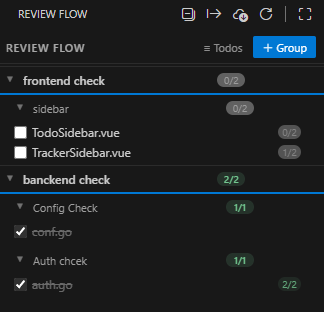
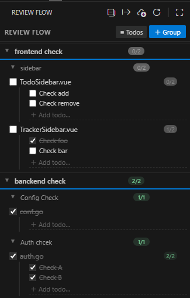

# Check Flow

A code review checklist manager for VS Code. Organize files into **groups** and **phases**, track review progress with **todos**, and never lose your place during a review session.

[中文文档](README.zh-cn.md)

---

## Preview

<p align="center">
  
  &nbsp;&nbsp;
  
</p>
<p align="center">
  <em>Left: files-only view &nbsp;·&nbsp; Right: full view with todo sub-items</em>
</p>

---

## Features

### Groups & Phases — two-level organization

Structure your review work with:

- **Groups** — top-level categories, e.g. "Frontend", "Backend", "QA"
- **Phases** — stages within a group, e.g. "Phase 1 — Core", "Sprint 42"

Double-click any group or phase name to rename it inline.

### Files with Todo sub-items

Each file in a checklist can have its own todo list:

```
[□] UserInfo.vue                   1/3
    │ [☑] Check layout on mobile
    │ [□] Verify API error states
    │ [□] Check loading skeleton
    │ + Add todo…
```

- Toggle **≡ Todos** in the sidebar toolbar to show or hide the todo layer
- When **all todos are checked**, the parent file is automatically marked as done
- When **any todo is unchecked**, the parent file is automatically unmarked
- The `1/3` pill on each file row shows todo progress even when todos are hidden

### Progress tracking

Every group and phase shows a `done/total` badge and an animated progress bar.

### Drag & drop reordering

Drag file rows within a phase or across phases/groups. A blue insertion line shows exactly where the file will land.

### Add files from Explorer

**Option 1 — Right-click** (recommended, supports multi-select)

Select one or more files/folders in the Explorer → right-click → **Add to Check Flow…** → pick group → pick phase.

**Option 2 — + Files button**

Click **+ Files** next to a phase name → native file picker (supports multi-select and folders).

**Option 3 — Drop zone**

Drag files from your OS file manager onto a phase's drop zone.

### JSON Export / Import

Icons in the panel title bar:

| Icon | Action |
|------|--------|
| Export | Save the full checklist as human-readable JSON |
| Import | Load a JSON file (replace current data or merge) |

Exported JSON is designed to be readable by humans and AI alike:

```json
{
  "version": 1,
  "exportedAt": "2026-03-15T10:00:00.000Z",
  "workspace": "my-project",
  "summary": "2 groups, 8 files, 5 checked",
  "groups": [
    {
      "name": "Frontend Review",
      "phases": [
        {
          "name": "Phase 1 — Core",
          "progress": "2/4 files",
          "files": [
            {
              "name": "index.vue",
              "path": "src/views/index.vue",
              "checked": true,
              "todos": [
                { "text": "Check layout", "checked": true },
                { "text": "Check API", "checked": true }
              ]
            }
          ]
        }
      ]
    }
  ]
}
```

### Collapse all

Click the collapse icon in the panel title bar (or run **Check Flow: Collapse / Expand All Groups**) to fold every group at once. Click again to expand all.

---

## Getting Started

1. Open the **Review Flow** panel in the Activity Bar
2. Click **＋ Group** → name your group (e.g. "Frontend Review")
3. Click **+ Phase** → name your phase (e.g. "Sprint 42")
4. Right-click files in Explorer → **Add to Check Flow…** → select group & phase
5. Click a filename to open it in the editor
6. Check the checkbox when done — or add todos first for finer-grained tracking

---

## Keyboard Shortcuts

| Action | Key |
|--------|-----|
| Confirm inline form | `Enter` |
| Cancel form or inline edit | `Escape` |
| Add todo | Type in the `+ Add todo…` field → `Enter` |
| Rename group / phase | Double-click the name |

---

## Commands

All commands are available via `Ctrl+Shift+P` under the **Check Flow** category:

| Command | Description |
|---------|-------------|
| Refresh | Reload the webview |
| Collapse / Expand All Groups | Toggle collapse state of all groups |
| Export as JSON | Save checklist to a JSON file |
| Import from JSON | Load checklist from a JSON file |
| Add to Check Flow… | Add selected Explorer items to a phase |

---

## Data Storage

All data is saved to VS Code's **workspace state** — one independent checklist per workspace. Nothing is written to disk unless you explicitly export.

---

## Using the exported JSON with AI

Export your checklist via the panel title bar → **Export as JSON**, then paste the file content into your AI conversation.

### Suggested prompts

```
以下是我的代码检查清单，请帮我分析哪些文件还没检查，并给出检查建议：
[粘贴 JSON]
```

```
Here is my review checklist. Based on the unchecked files and their todos,
suggest what to focus on next:
[paste JSON]
```

### What the AI can help with

| Scenario | Example prompt |
|----------|----------------|
| Prioritize remaining files | "Which unchecked files are most likely to have bugs?" |
| Generate todos automatically | "For each unchecked file, suggest 3 review todos based on the filename" |
| Summarize progress | "Summarize the review status across all groups" |
| Re-import after AI edits | Ask the AI to return updated JSON, then import it back |

### JSON schema reference

```jsonc
{
  "version": 1,               // always 1
  "exportedAt": "ISO-8601",   // export timestamp
  "workspace": "string",      // VS Code workspace folder name
  "summary": "string",        // human-readable progress summary
  "groups": [
    {
      "name": "string",       // group label, e.g. "Frontend"
      "phases": [
        {
          "name": "string",   // phase label, e.g. "Phase 1"
          "progress": "x/y files",
          "files": [
            {
              "name": "string",     // filename only, e.g. "index.vue"
              "path": "string",     // absolute path on disk
              "checked": boolean,   // true = review done
              "todos": [
                {
                  "text": "string",    // todo description
                  "checked": boolean   // true = todo done
                }
              ]
            }
          ]
        }
      ]
    }
  ]
}
```

### Round-trip: AI edits → re-import

The AI can return a modified JSON (e.g. with new todos, updated `checked` states, or new phases). To apply the changes:

1. Save the AI's output as a `.json` file
2. In VS Code → panel title bar → **Import from JSON**
3. Choose **Merge** to append, or **Replace** to overwrite

---

## License

MIT © [YUE LI](https://github.com/Yuelioi)
